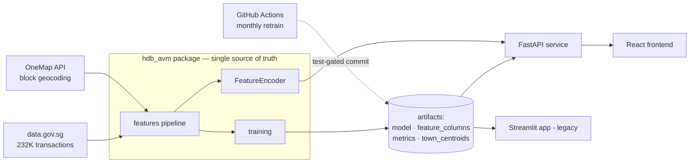

# HDB Automated Valuation Model (AVM)

An Automated Valuation Model trained on 232,000+ HDB resale transactions, served by a FastAPI backend with a React frontend. Modelled on the collateral validation tools used by bank home loan teams to sanity-check property valuations before mortgage approval.

**[Live demo (Streamlit) →](https://hdb-avm-aj2yyyvwanht7ghcwpv8gs.streamlit.app/)** · FastAPI + React deployment in progress

---

## The Problem

When a bank approves a mortgage, it needs to know the flat is worth what the buyer is paying. Manual valuations are slow and expensive. Automated Valuation Models run instantly at scale — but their error rate directly determines the bank's collateral mispricing exposure.

This model's $38,734 RMSE on a ~$630,000 flat means roughly 6% mispricing exposure on a typical loan. The API quantifies that exposure per valuation — at town-level granularity, because a Central Area flat (±$80,880) is a very different risk from a Choa Chu Kang flat (±$26,372).

---

## Architecture



The design constraint that shaped everything: **training and serving import the same feature code** (`hdb_avm.features`), so what the model sees in production is provably what it saw in training. Parity is enforced by tests, not convention.

**Artifact contract.** Training writes four artifacts: the model, the feature column order, computed evaluation metrics (including per-town RMSE on the held-out window), and town centroids. Both frontends read these artifacts — no metric or category list is hardcoded anywhere downstream. A monthly GitHub Actions run refreshes the data, retrains, and only commits new artifacts if the full test suite passes against them.

---

## API

`POST /api/v1/valuations` accepts three location precisions:

| Input | Resolution |
|---|---|
| `address` | Geocoded live via OneMap → block-level coordinates |
| `latitude` + `longitude` | Used directly |
| neither | Town centroid (computed at training time) |

MRT distance is computed from the resolved coordinates (haversine, 160+ stations) unless supplied. The response includes the point estimate, a town-level confidence band, lender mispricing exposure, and an exact TreeSHAP breakdown of what drove the price:

```json
{
  "point_estimate": 489862,
  "band_low": 423153, "band_high": 556571,
  "rmse": 66709, "rmse_scope": "town",
  "mispricing_exposure_pct": 13.6,
  "resolved_location": { "coordinate_source": "town_centroid", "nearest_mrt": "Queenstown", ... },
  "explanation": { "baseline": 517213, "contributions": [ ... ] }
}
```

Also: `GET /api/v1/metadata` (valid categories + model summary), `GET /api/v1/metrics` (full evaluation artifact), `GET /api/v1/trends` (quarterly medians), `GET /health`. Interactive docs at `/docs`.

---

## Model

| Model | RMSE | R² |
|---|---|---|
| Linear Regression (baseline) | $87,626 | 0.827 |
| XGBoost | **$38,734** | **0.966** |

(Figures from `models/metrics.json`, recomputed on every retrain and bound to the model binary by SHA-256.)

**Training split:** time-ordered, most recent 10% of transactions held out. A random split would leak future prices into training and overstate real-world accuracy.

**Features (41):** floor area, storey midpoint, remaining lease (parsed from strings like "61 years 04 months"), transaction year/month, block-level latitude/longitude (9,714 blocks geocoded via OneMap), distance to nearest MRT, town and flat type one-hots.

**Explainability:** SHAP values come from XGBoost's native `pred_contribs` — mathematically identical to `shap.TreeExplainer` output, without shipping the shap dependency in the serving image (and immune to shap/xgboost version breakage).

### Why town RMSE varies

The model struggles most in mature, heterogeneous estates — Central Area (±$80,880), Queenstown (±$66,709), Bishan (±$58,240) — where a 1990 ground-floor 3-room and a 2015 high-floor 5-room share a town label but price worlds apart. It performs best in newer, uniform towns like Choa Chu Kang (±$26,372) and Sembawang (±$26,990).

**Known limitation:** Tengah has zero resale transactions (flats still under the Minimum Occupation Period). The API refuses to extrapolate there — unknown towns return a 422, not a guess.

---

## Engineering notes

- **No training/serving skew by construction.** One `FeatureEncoder`, driven entirely by the `feature_columns.json` artifact; a parity test suite proves it reproduces the legacy app's encoding byte-for-byte, plus golden predictions pinned to the deployed model generation (auto-skipped after retrains).
- **Test-gated retraining.** The monthly pipeline retrains, recomputes per-town metrics on the new held-out window, runs the full test suite against the fresh artifacts, and only then commits.
- **Honest uncertainty.** Confidence bands use town-level RMSE (published only for towns with ≥30 test samples), and every valuation reports the lender's mispricing exposure.
- Test suite spans unit (parsing, geo, encoding), serving-layer, end-to-end API (OneMap mocked — no network in CI), legacy-parity, and an artifact-integrity check that binds metrics.json to the exact model binary by SHA-256 — so a retrain on main can never silently merge against stale metrics.

---

## Project structure

```
hdb-avm/
├── hdb_avm/              # Shared Python package
│   ├── features/         #   parsing, geo, encoding, training pipeline
│   ├── ml/               #   model registry + valuation service
│   ├── training/         #   train + compute metrics artifacts
│   ├── api/              #   FastAPI app, routers, schemas, OneMap client
│   └── config.py         #   env-overridable settings (HDB_*)
├── web/                  # React frontend (Vite + TS + Tailwind + Recharts)
├── app/main.py           # Legacy Streamlit app (still deployed)
├── models/               # Artifacts: model, columns, metrics, centroids
├── data/                 # Raw + processed data, MRT coords, trends
├── src/                  # Data-fetch scripts + deprecated shims
├── tests/                # unit, API, legacy-parity, artifact-integrity
└── .github/workflows/    # ci.yml (lint+test) · retrain.yml (monthly, test-gated)
```

---

## Run locally

```bash
git clone https://github.com/bryan2804/hdb-avm.git && cd hdb-avm
make install          # pip install -e ".[api,dev]"
make dev-api          # FastAPI on :8000 (docs at /docs)
make dev-web          # React on :5173, proxies /api to :8000
make test             # ruff + full test suite
```

Or the API via Docker: `docker build -t hdb-avm . && docker run -p 8000:8000 hdb-avm`

**Data:** data.gov.sg HDB resale prices (Jan 2017 – Jun 2026) · **Geocoding:** OneMap API
